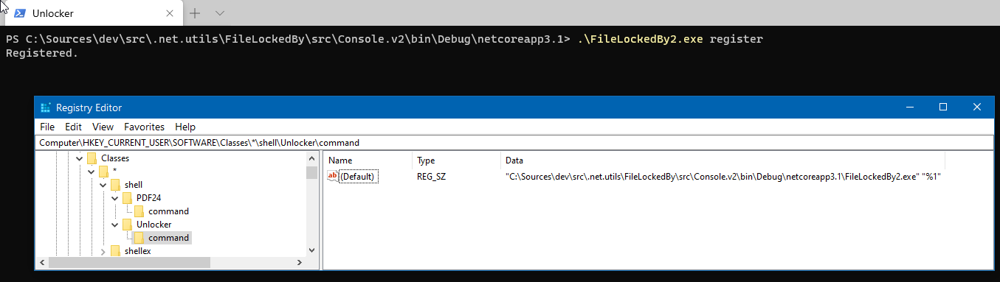
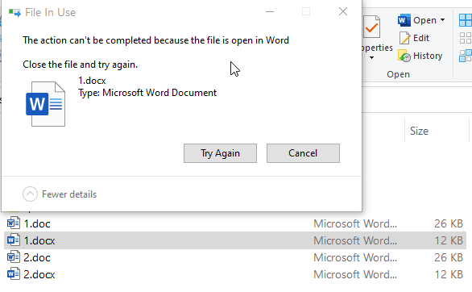
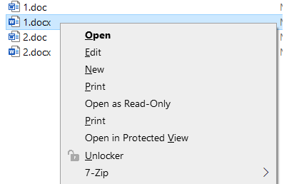
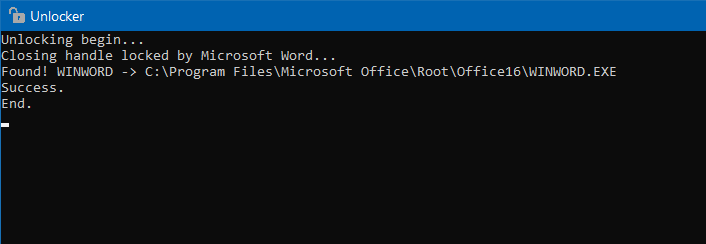
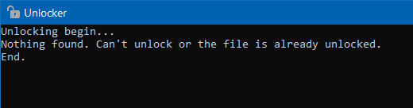
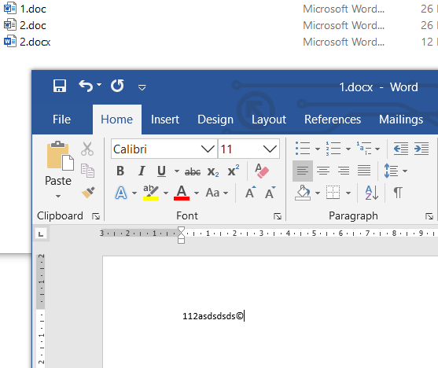

# Applications

## Console v1

A legacy method of searching the exact process which locks the specified file. 
Use *ExclusionFolders.txt* and *ExclusionProcesses.txt* to speed-up the process.

## Console v2

Allows to find the exact process pretty quick via Restart Manager API.

### Usage

Run the application with a specified file to unlock it. 
`FileLockedBy.exe myDocument.docx` 

### Explorer integration

Register the application 
 
Navigate to a locked file which needs to be deleted 
 
Do mouse right-click on the file 
 
Click *Unlocker* in the menu 
 
Click *Unlocker* once again to be sure the file is unlocked 
 
Delete the file 
 
*PROFIT!*

*Microsoft.Win32.Registry* is used due to .Net core limitations. 